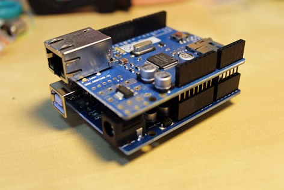
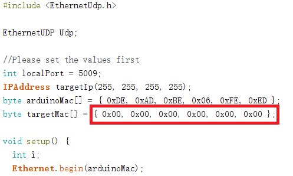
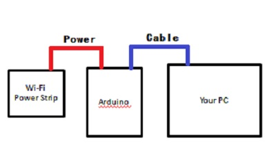

# Overview
* Wakeup is for waking up your remote PC.

# How to make it work
1. Make sure your PC network card supports WOL.
2. You need an Arduino board with Ethernet module and a Wi-Fi smart power strip.
3. Replace the Taget MAC address in source code with your PC network card MAC address.

4. Connect them like that:

5. Then it works, when you turn on the Wi-Fi power strip, Arduino will send a "magic package" to your PC and turn on it.
